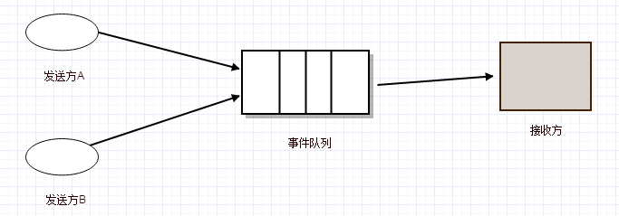
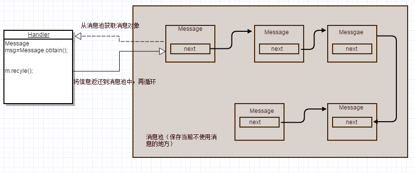

#Android 线程间通信机制（ITC详解）

本文原创自[飞奔的蜗牛][1]——转载请加以说明
##概述
---

Android系统会生成main线程（UI线程），是并发处理UI传递事件的最重要线程。如果在main线程中直接运行网络I/O操作等，响应速度降低，如果5秒没有响应，会发生ANR。
Android不建议用户在main线程中处理耗时操作，而是生成新的线程来处理，让main线程接收并处理该结果。

##生成线程的方法
---
```java
class A extends Thread
{
public void run()
{
}
}
A a=new A();
a.start();
```
```java
class B implements Runable
{
public void run()
{
}
}
B b=new B();
Thread t=new Thread(b);
t.start();
```
##线程间通信机制
###异步数据传输

发送方并不直接向接收方发送事件，而是向接收方的事件队列发送事件，发送方不需在接收方接收事件前一直处于阻塞状态，发送后可以立即执行其他任务，接收方也不需要为等待各个发送方的事件而处于阻塞状态，可以对到达事件队列的事件进行处理.

Android的应用程序是默认使用main线程处理所有操作的单线程结构，出现如下情况将弹出ANR
应用程序5秒后仍未对用户的输入事件作出相应
广播接收器10秒内未返回
###消息通信模型

下面将根据通信模型来具体分析通信机制
####Message
生成message的方法
方法1	Message msg=new Messgae();	直接生成并获取消息对象
方法2	Messgae msg=Message.obtain();	从消息池中获取消息对象
方法3	Handler handler=new Handler();handler.obtainMessage();
从想要发送消息的handler获取消息
obtain函数源码（framwork/base/core/java/android/os/Message.java)
```java
 
private static final Object sPoolSync = new Object();
private static Message sPool;
 /**
     * Return a new Message instance from the global pool. Allows us to
     * avoid allocating new objects in many cases.
     */
    public static Message obtain() {
        synchronized (sPoolSync) {
            if (sPool != null) {    //从消息池中返回对象
                Message m = sPool;
                sPool = m.next;
                m.next = null;
                sPoolSize--;
                return m;
            }
        }
        return new Message();
    }
```
从消息池获取消息过程&返回消息到消息池

2.消息回收（framwork/base/core/java/android/os/Message.java)
```java
/**
     * Return a Message instance to the global pool.  You MUST NOT touch
     * the Message after calling this function -- it has effectively been
     * freed.
     */
    public void recycle() {
        clearForRecycle();//消息初始化
        synchronized (sPoolSync) {
            if (sPoolSize < MAX_POOL_SIZE) {
                next = sPool;//将消息返还给消息池
                sPool = this;
                sPoolSize++;//消息池中消息对象+1
            }
        }
    }
```
####Looper
```java
* <p>This is a typical example of the implementation of a Looper thread,
  * using the separation of {@link #prepare} and {@link #loop} to create an
  * initial Handler to communicate with the Looper.
  *
  * <pre>
  *  class LooperThread extends Thread {
  *      public Handler mHandler;
  *
  *      public void run() {
  *          Looper.prepare();//$1 线程需要调用Looper的prepare()静态方法实现在当前线程中生成Looper
  *
  *          mHandler = new Handler() {//运行looper的prepare方法后，需要生成线程的handler，子类必须实现handleMessgae（）方法，并接收信息
  *              public void handleMessage(Message msg) {
  *                  // process incoming messages here
  *              }
  *          };
  *
  *          Looper.loop();//$3从消息队列分发消息，每当消息队列接收到消息的时候，取出消息单独处理，如果没有接收到消息，阻塞等待，直到新消息到达
  *      }
  *  }</pre>
```
$1通过下面的代码发现prepare为静态函数，所以一个线程中looper只有一个
```java
   /** Initialize the current thread as a looper.
      * This gives you a chance to create handlers that then reference
      * this looper, before actually starting the loop. Be sure to call
      * {@link #loop()} after calling this method, and end it by calling
      * {@link #quit()}.
      */
    public static void prepare() {
        prepare(true);
    }
    private static void prepare(boolean quitAllowed) {
        if (sThreadLocal.get() != null) {
            throw new RuntimeException("Only one Looper may be created per thread");
        }
        sThreadLocal.set(new Looper(quitAllowed));//$2
    }
```
$2从prepare函数可以看到new Looper()对象，查看Looper的构造函数可以发现，在Looper.prepare()时，生成Looper对象的同时也生成了MessageQueue对象
$3 loop函数
```java
/**
     * Run the message queue in this thread. Be sure to call
     * {@link #quit()} to end the loop.
     */
    public static void loop() {
        final Looper me = myLooper();返回的looper对象
        if (me == null) {
            throw new RuntimeException("No Looper; Looper.prepare() wasn't called on this thread.");
        }
        final MessageQueue queue = me.mQueue;//looper从消息队列取出消息运行，获得与当前运行线程相关的looper对象的消息队列
        // Make sure the identity of this thread is that of the local process,
        // and keep track of what that identity token actually is.
        Binder.clearCallingIdentity();
        final long ident = Binder.clearCallingIdentity();
        for (;;) {
            Message msg = queue.next(); // 消息到达消息队列之前，looper一直以阻塞状态等待，消息到达消息队列后，返回并开始处理消息
            if (msg == null) {
                // No message indicates that the message queue is quitting.
                return;
            }
            // This must be in a local variable, in case a UI event sets the logger
            Printer logging = me.mLogging;
            if (logging != null) {
                logging.println(">>>>> Dispatching to " + msg.target + " " +
                        msg.callback + ": " + msg.what);
            }
            msg.target.dispatchMessage(msg);//looper从消息队列分发的消息指定接收消息的目标，looper浏览消息的target成员变量，决定由哪个handler进行处理，然后调用接收消息的handler的dispatchMessage方法
            if (logging != null) {
                logging.println("<<<<< Finished to " + msg.target + " " + msg.callback);
            }
            // Make sure that during the course of dispatching the
            // identity of the thread wasn't corrupted.
            final long newIdent = Binder.clearCallingIdentity();
            if (ident != newIdent) {
                Log.wtf(TAG, "Thread identity changed from 0x"
                        + Long.toHexString(ident) + " to 0x"
                        + Long.toHexString(newIdent) + " while dispatching to "
                        + msg.target.getClass().getName() + " "
                        + msg.callback + " what=" + msg.what);
            }
            msg.recycle();//消息循环
        }
    }
```
####handler
#####1.生成handler
方法1
```java
class A extends Handler 
{

//覆盖handle默认的handleMessage方法
public void handleMessage(Message msg)
{
//...
}
}
```
方法2
```java
class B extends Activity
{
Handler handler=new Handler()
{
public void handleMessage(Message msg)
{
//...
}
};
}
```
handler中最基本的构造函数
```java
 /**
     * Use the {@link Looper} for the current thread with the specified callback interface
     * and set whether the handler should be asynchronous.
     *
     * Handlers are synchronous by default unless this constructor is used to make
     * one that is strictly asynchronous.
     *
     * Asynchronous messages represent interrupts or events that do not require global ordering
     * with represent to synchronous messages.  Asynchronous messages are not subject to
     * the synchronization barriers introduced by {@link MessageQueue#enqueueSyncBarrier(long)}.
     *
     * @param callback The callback interface in which to handle messages, or null.
     * @param async If true, the handler calls {@link Message#setAsynchronous(boolean)} for
     * each {@link Message} that is sent to it or {@link Runnable} that is posted to it.
     *
     * @hide
     */
    public Handler(Callback callback, boolean async) {
        if (FIND_POTENTIAL_LEAKS) {
            final Class<? extends Handler> klass = getClass();
            if ((klass.isAnonymousClass() || klass.isMemberClass() || klass.isLocalClass()) &&
                    (klass.getModifiers() & Modifier.STATIC) == 0) {
                Log.w(TAG, "The following Handler class should be static or leaks might occur: " +
                    klass.getCanonicalName());
            }
        }
        mLooper = Looper.myLooper();
        if (mLooper == null) {
            throw new RuntimeException(
                "Can't create handler inside thread that has not called Looper.prepare()");//从这里也可以很明显的验证通信框架图，在Looper.prepare()后，实现生成MessageQueue与Looper后，在生成handler
        }
        mQueue = mLooper.mQueue;//获取looper对象
        mCallback = callback;
        mAsynchronous = async;
    }
```
获取消息
```java
/**
     * Returns a new {@link android.os.Message Message} from the global message pool. More efficient than
     * creating and allocating new instances. The retrieved message has its handler set to this instance (Message.target == this).
     *  If you don't want that facility, just call Message.obtain() instead.
     */
    public final Message obtainMessage()
    {
        return Message.obtain(this);
    }

...
```
消息传输
```java
/**
     * Pushes a message onto the end of the message queue after all pending messages
     * before the current time. It will be received in {@link #handleMessage},
     * in the thread attached to this handler.
     *  
     * @return Returns true if the message was successfully placed in to the 
     *         message queue.  Returns false on failure, usually because the
     *         looper processing the message queue is exiting.
     */
    public final boolean sendMessage(Message msg)
    {
        return sendMessageDelayed(msg, 0);
    }

...
```
####2.Runable对象的传输
Runable接口
```java
@FunctionalInterface
public interface Runnable {
    /**
     * When an object implementing interface <code>Runnable</code> is used
     * to create a thread, starting the thread causes the object's
     * <code>run</code> method to be called in that separately executing
     * thread.
     * <p>
     * The general contract of the method <code>run</code> is that it may
     * take any action whatsoever.
     *
     * @see     java.lang.Thread#run()
     */
    public abstract void run();
}
```
Runable 对象的生成
```java
Runnabke r=new Runnable()
{
public void run()
{
//runnable对象的实际运行代码
}
}
```
在framwork/base/core/java/android/os/Handler.java中，Runable对象的传输
```java
 /**
     * Causes the Runnable r to be added to the message queue.
     * The runnable will be run on the thread to which this handler is 
     * attached. 
     *  
     * @param r The Runnable that will be executed.
     * 
     * @return Returns true if the Runnable was successfully placed in to the 
     *         message queue.  Returns false on failure, usually because the
     *         looper processing the message queue is exiting.
     */
    public final boolean post(Runnable r)
    {
       return  sendMessageDelayed(getPostMessage(r), 0);//传输到消息队列
    }
```
通过post()我们可以发现将Runable对象传输到looper的消息队列。

Runnable对象的消息处理
```java
 /**
     * Handle system messages here.
     */
    public void dispatchMessage(Message msg) {
        if (msg.callback != null) {
            handleCallback(msg);//$1
        } else {
            if (mCallback != null) {
                if (mCallback.handleMessage(msg)) {
                    return;
                }
            }
            handleMessage(msg);//如果传输了非Runable对象的消息，调用handleMessgae()对象进行处理
        }
    }
```
$1运行runable对象
```java
 private static void handleCallback(Message message) {
        message.callback.run();
    }
```
###HandlerThread
Thread默认不包含messageQueue和Looper，android提供HandlerThread线程的方法创建Looper，生成HandlerThread时，自动生成并运行Looper。

 继承Thread（framwork/base/core/java/android/os/HandlerMessage.java）
```java

/**
 * Handy class for starting a new thread that has a looper. The looper can then be 
 * used to create handler classes. Note that start() must still be called.
 */
public class HandlerThread extends Thread {...}
```
HandlerThread中的getLooper()方法
```java
 /**
     * This method returns the Looper associated with this thread. If this thread not been started
     * or for any reason is isAlive() returns false, this method will return null. If this thread 
     * has been started, this method will block until the looper has been initialized.  
     * @return The looper.
     */
    public Looper getLooper() {
        if (!isAlive()) {
            return null;
        }
        
        // If the thread has been started, wait until the looper has been created.
        synchronized (this) {
            while (isAlive() && mLooper == null) {
                try {
                    wait();
                } catch (InterruptedException e) {
                }
            }
        }
        return mLooper;
    }

```
使用HandlerThread生成带有Looper的线程
```java
class Work extends Handler
{
public void Work(Looper loop)
{
super(loop);
}
public void handleMessage(Message msg)
{
//
}
}
HandlerThread workthread=new HandlerThread("workthread");//创建一个名为workthread的线程
workthread.start();//启动
Looper loop=workthread.getLooper();//获得HandlerThread的looper
Work workhandler=new Work(loop);//生成handler
```


  [1]: https://huangxiankui.github.io/blog/index.html